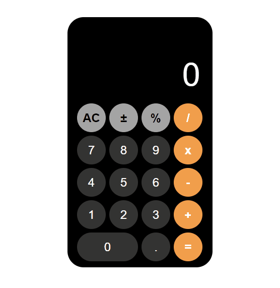

# calculatorWithJs

# 👉 Learn-Javascript-DOM  👈

####  ✔ This project is for beginners trying to learn Javascript DOM(Document Object Model) 🪁.

[Click Here](https://ridvankoseler.github.io/calculatorWithJs/)

